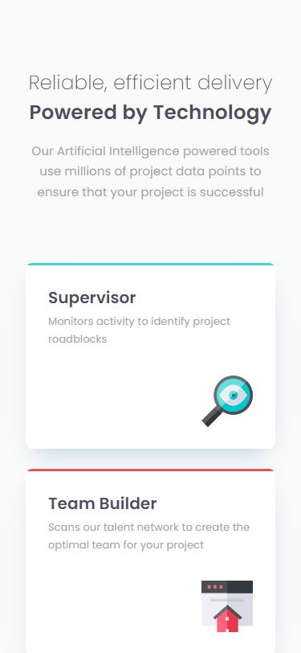
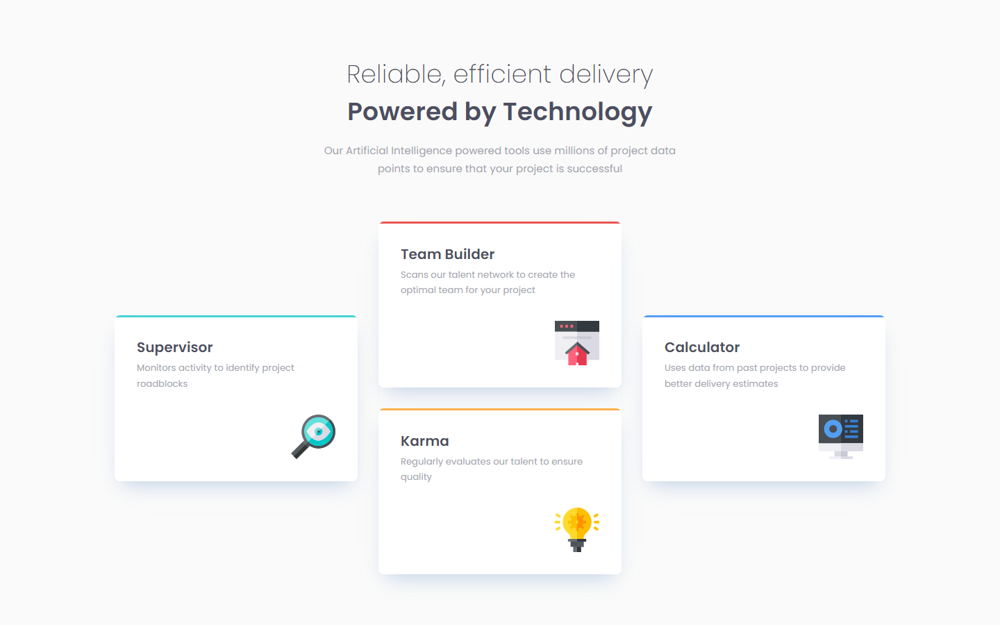

# Frontend Mentor - Four card feature section solution

This is a solution to the [Four card feature section challenge on Frontend Mentor](https://www.frontendmentor.io/challenges/four-card-feature-section-weK1eFYK). Frontend Mentor challenges help you improve your coding skills by building realistic projects.

## Table of contents

- [Overview](#overview)
  - [The challenge](#the-challenge)
  - [Screenshot](#screenshot)
  - [Links](#links)
- [My process](#my-process)
  - [Built with](#built-with)
  - [What I learned](#what-i-learned)
  - [Continued development](#continued-development)
- [Author](#author)

## Overview

### The challenge

Users should be able to:

- View the optimal layout for the site depending on their device's screen size

### Screenshot

### Mobile Version

### Desktop Version

### Links

- Solution URL: [Frontend Mentor solution](https://www.frontendmentor.io/solutions/responsive-four-card-feature-using-css-grid-hgYwRLVXHV)
- Live Site URL: [Demo](https://dz-four-card-feature-section.vercel.app/)

## My process

### Built with

- Semantic HTML5 markup
- CSS custom properties
- Flexbox
- CSS Grid
- Mobile-first workflow
- BEM
- Logical Properties

### What I learned

This solution was my second submission to this challenge, more than learning I reinforced my knowledge.
I'm happy with how I improved my skills along the way, the journey is still long of course, but when you look back and you touch the improvement there are only three things to do:
- To be proud of themselves 🥲
- Keep learning 📖
- Keep coding 💻

### Continued development

Like this project, by the next one, I'll be focused on CSS Grid, Flexbox, Fluid typography, Fluid spacing, Custom properties and how to build responsive layouts without using media queries.

## Author

- Frontend Mentor - [@dedo-dev](https://www.frontendmentor.io/profile/dedo-dev)
- Linkedin - [@daniele-zeppieri](https://www.linkedin.com/in/daniele-zeppieri-0b1a36252/)